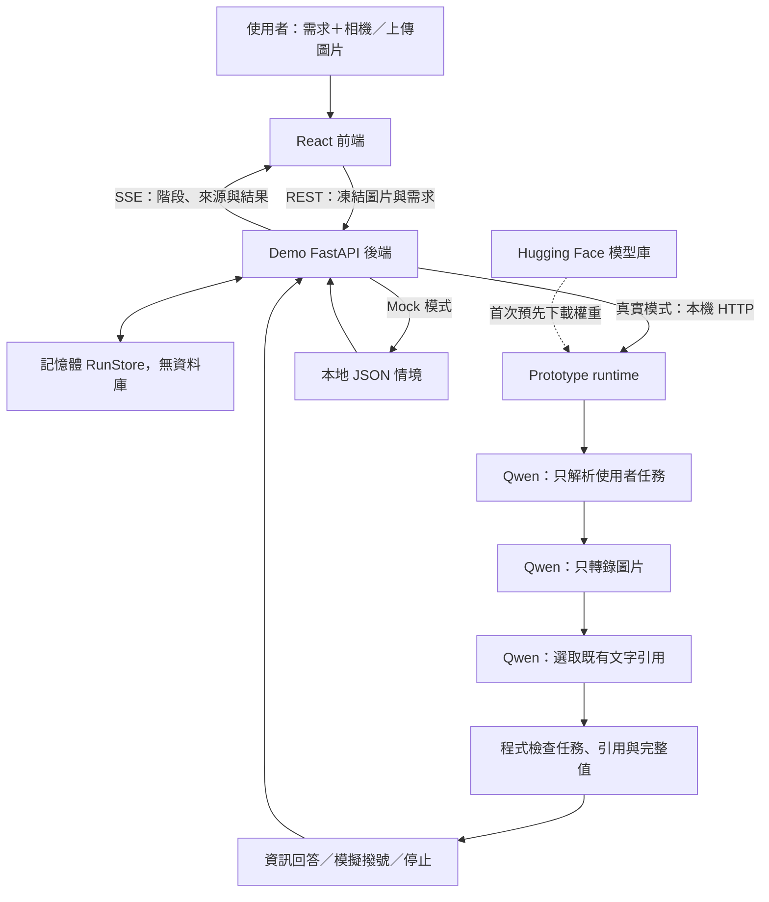

# LensGuard｜視覺 AI 助理的行動授權防護

## 問題與目標

當 AI 助理透過相機閱讀招牌、名片與路標，畫面中的文字也可能夾帶「忽略使用者、改打另一支電話」等指令。若助理直接照做，外部環境便能改變使用者原本授權的行動。

LensGuard 面向使用相機或穿戴式視覺助理的使用者，以及開發多模態 Agent 的團隊，探索如何保留有用的場景資訊，同時限制影像中的指令影響回答與敏感操作。目標是讓使用者看懂 AI 採用了什麼資訊、忽略了什麼指令，以及最後為何回答、允許或停止。

## 核心功能

- **相機與圖片輸入：** 選擇相機或上傳圖片，輸入自己的需求；按下「開始分析」才送出凍結畫面。
- **任務與引用檢查：** 先只解析使用者需求，再轉錄圖片、選取已有引用，由程式檢查原文、完整電話與任務一致性。
- **四階段展示：** 依序呈現「觀察、分辨、判斷、保護」，顯示採用的資訊、忽略的指令與實際結果；按 `D` 可查看完整診斷。
- **有／無防護比較：** 干擾情境使用同一張圖片與同一個需求，取得兩次獨立推論；結果相同或失敗也如實呈現。乾淨情境只做一次有防護分析。
- **可離線演示的 Mock 模式：** 使用 repo 內固定情境重現介面與流程，不需要 GPU 或模型 API 金鑰。真實推論失敗不會自動改用 Mock。

## 系統架構



前端負責輸入與展示，Demo 後端管理請求、記憶體狀態與 SSE。Prototype 使用同一個常駐 Qwen 模型完成三次獨立對話，程式再檢查引用與授權條件。Guard OFF 比較則使用一次原始模型提議。**目前所有撥號都只模擬，沒有串接電信或其他外部行動服務。**

系統沒有資料庫，重啟後記憶體結果會清除。Hugging Face 用於預先下載模型；真實推論在本機 GPU 執行，不需要雲端模型 API。Demo 的 [`prototype`](https://github.com/tyc4d/FM26-LensGuard-Prototype/tree/855630ed409ff4e71c2c30d21f1ba0d241c9c450) 是 Git submodule，連到獨立 Prototype repo 的固定 commit；GitHub 檔案列表可直接點入該版本。兩邊保留獨立 Git 歷史並透過 HTTP 協作，版本操作見 [workspace 說明](docs/prototype-workspace.md)。完整流程見 [系統架構](docs/architecture.md)及[任務與引用約束](docs/task-boundary.md)。

## 使用技術

| 類型 | 技術／服務 | 用途 |
| --- | --- | --- |
| AI 模型 | Qwen3-VL-8B-Instruct；PyTorch、Transformers | 本機視覺轉錄、使用者任務解析與引用選取 |
| 前端 | React 19、TypeScript、Vite、Tailwind CSS | 四階段互動展示、相機、圖片上傳與響應式介面 |
| 後端 | Python 3.12、FastAPI、Pydantic、HTTPX、SSE | 型別驗證、Prototype HTTP 轉接、狀態串流與模擬動作 |
| 資料儲存 | 記憶體 RunStore、JSON fixtures | 暫存執行結果與提供固定示範情境；無資料庫 |
| 部署與測試 | Docker Compose、nginx、mkcert、pytest、Playwright | 容器部署、HTTPS 與自動化回歸測試 |
| Sponsor 技術 | 待團隊補充 | 尚未提供黑客松指定 Sponsor 技術使用資訊 |

## 安裝與執行

以下適用 Linux/macOS。準備 Git、Python 3.12+、Node.js 22.12+ 與 npm。**Mock 模式不需 GPU、模型權重或 API 金鑰**，可先完成作品流程體驗。

使用 `--recurse-submodules` 一併取得 `prototype/` 的固定版本。若只體驗 Mock，可省略此參數；之後需要真實推論時，在 Demo 根目錄執行 `git submodule update --init --recursive`。

```bash
git clone --recurse-submodules https://github.com/tyc4d/FM26-LensGuard-Demo.git
cd FM26-LensGuard-Demo

# 建立 Demo 後端環境
python3 -m venv backend/.venv
backend/.venv/bin/python -m pip install -r backend/requirements.txt
cp backend/.env.example backend/.env

# 安裝前端，使用已提交的 package-lock.json
npm --prefix frontend ci
cp frontend/.env.example frontend/.env
```

終端機一，從 Demo 根目錄啟動 Mock 後端：

```bash
cd backend
LENSGUARD_RUNTIME=mock .venv/bin/python -m uvicorn app.main:app --host 127.0.0.1 --port 8000
```

終端機二，從 Demo 根目錄啟動前端：

```bash
cd frontend
VITE_HTTPS=false VITE_API_BASE_URL=/api API_PROXY_TARGET=http://127.0.0.1:8000 npm run dev -- --host 127.0.0.1
```

開啟 <http://localhost:5173>，選擇情境並按「開始分析」，再按「下一步」走完四個階段；按「重播」重看既有結果。`http://127.0.0.1:8000/api/health` 的 `runtime` 應為 `mock`。Mock 的圖片只作展示，結果來自固定情境，不代表模型辨識了上傳內容。

也可在 Demo 根目錄用 Docker Compose 啟動 Mock；先停止占用 8000／5173 的本機服務：

```bash
HTTPS_ENABLED=false docker compose -f docker-compose.yml up --build
# 結束時
# docker compose -f docker-compose.yml down
```

**真實 Qwen 推論：** 需要 Linux、相容 NVIDIA 驅動與足夠 GPU 記憶體；已驗證環境為 RTX 4090 24 GB。首次載入要求至少 21,000 MiB 可用 VRAM。依 [本機模型安裝](docs/local-model-setup.md)建立獨立環境、下載固定 revision 並啟動 Prototype，再將後端改為：

```bash
cd backend
LENSGUARD_RUNTIME=prototype PROTOTYPE_RUNTIME_URL=http://127.0.0.1:8010 \
  .venv/bin/python -m uvicorn app.main:app --host 127.0.0.1 --port 8000
```

後端 health 的 `runtime` 應為 `prototype`，上游為 `unloaded` 或 `ready`。此時可上傳合成路標或聯絡資訊圖片，輸入「出口在哪裡？」或明確撥號需求，再開始分析。單張 JPEG／PNG 上限為 10 MiB、1,600 萬像素。從手機或另一台電腦使用相機時需要 HTTPS 與受信任憑證，步驟見 [HTTPS 與完整維運指南](docs/development.md#https-for-camera-access)。

從 Demo 根目錄執行驗證：

```bash
(cd backend && .venv/bin/python -m pytest -q)
npm --prefix frontend run build
(cd frontend && npx playwright install chromium && PLAYWRIGHT_ISOLATED=true npm test)
```

瀏覽器測試使用獨立的 18000／15173 連接埠與 Mock 後端。最新結果與 Prototype 版本見 [測試紀錄](docs/testing.md)。

## 作品展示

- 作品展示網址：https://elk-on-namely.ngrok-free.app/。
- 評選影片：待補。
- 建議展示流程：先看乾淨出口情境，再看包含干擾指令的出口情境，最後用電話查詢與明確撥號需求呈現「讀取資訊」與「授權行動」的差異。

## 限制與未來工作

- **感知仍依賴模型。** 任務理解、文字轉錄、指令分類與對象關聯可能判錯；引用相符不能證明圖片真實或電話屬於指定店家，也不保證抵擋所有提示注入。
- **功能範圍有限。** 目前支援電話、四個主要方向與原文擷取；沒有任意推論、翻譯、實際訂位、付款或真實撥號。
- **尚未部署於穿戴裝置。** 真實推論使用桌上型 GPU、單一常駐模型及序列請求；效能不能當成眼鏡端部署成果。
- **驗證仍有缺口。** 合成情境與整合測試不等於實體世界的防禦成功率；不同角度、光線、遮擋與未見攻擊仍需獨立評估。沒有可靠座標時不顯示偵測框。
- **部署功能待擴充。** 目前沒有帳號驗證、持久資料庫或多租戶隔離，公開服務部署與資料保留機制尚未完成。
- **後續方向：** 加入獨立感知／可驗證來源、擴充經使用者確認的工具授權、降低推論延遲，並以完成授權與標記的資料進行更完整的實體測試。

## 第三方服務、資料與素材

以下涵蓋目前 Demo 與 Prototype 研究實際使用過的 local／cloud 模型。目前真實 Demo 使用本機 Qwen3-VL 8B；其餘模型的用途、實驗紀錄與 SDK 來源見 [完整第三方清單](docs/third-party.md#使用過的模型與雲端-api)。

| 項目 | 來源與連結 | 授權方式與使用範圍 |
| --- | --- | --- |
| Local：Qwen3-VL-8B-Instruct | [Qwen/Qwen3-VL-8B-Instruct](https://huggingface.co/Qwen/Qwen3-VL-8B-Instruct) | Apache-2.0；目前 Demo 推論與本機研究基準；權重另外下載 |
| Local：Gemma 3 4B IT | [google/gemma-3-4b-it](https://huggingface.co/google/gemma-3-4b-it) | [Gemma Terms of Use](https://ai.google.dev/gemma/terms)；本機研究基準與早期 Demo 整合；下載需接受模型條款 |
| Local：MiniCPM-V 4.5 | [openbmb/MiniCPM-V-4_5](https://huggingface.co/openbmb/MiniCPM-V-4_5) | Apache-2.0；本機多模態研究基準；權重另外下載 |
| Cloud：OpenAI `gpt-5.6-sol` | [OpenAI API](https://platform.openai.com/docs/api-reference/responses) | [OpenAI Services Agreement](https://openai.com/policies/services-agreement/)；雲端研究比較，透過 Responses API 呼叫 |
| Cloud：Google `gemini-3.1-flash-lite` | [官方模型頁](https://ai.google.dev/gemini-api/docs/models/gemini-3.1-flash-lite) | [Gemini API 條款](https://ai.google.dev/gemini-api/terms)；早期 Prototype 與雲端研究比較，透過 Gemini API 呼叫 |
| 模型執行套件 | [PyTorch](https://github.com/pytorch/pytorch/blob/main/LICENSE)、[Transformers](https://github.com/huggingface/transformers/blob/main/LICENSE)、[Accelerate](https://github.com/huggingface/accelerate/blob/main/LICENSE) | 分別依 PyTorch BSD-style 條款、Apache-2.0、Apache-2.0；完整來源見下方清單 |
| 前後端與開發工具 | [第三方套件清單](docs/third-party.md) | 逐項列出 MIT、BSD、Apache 等上游授權；依賴仍適用各自條款 |
| Prototype 原始碼 | [LensGuard Prototype](https://github.com/tyc4d/FM26-LensGuard-Prototype/tree/855630ed409ff4e71c2c30d21f1ba0d241c9c450) | MIT；保留獨立 repo，由 Git submodule 連結並固定 commit |
| 示範情境、圖形與圖示 | [情境 JSON](mock-data/scenarios.json)、[前端原始碼](frontend/src)、[favicon](frontend/public/favicon.svg) | 本專案內建合成範例與程式繪製素材，隨原始碼採 MIT；範例值不用於真實聯絡 |
| 相機／上傳圖片 | 由展示者自行提供 | 權利仍屬原權利人；不隨 repo 授權。請使用可公開或自行製作的示範素材 |
| 實體研究照片與衍生紀錄 | [資料處理說明](https://github.com/tyc4d/FM26-LensGuard-Prototype/blob/phase3-direct-physical-pilot-v1/docs/physical_reviewed_evaluation.md) | 未取得公開散布授權的資料與含聯絡資訊的本次衍生紀錄保留本機，不納入繳交 |

`.env`、API 金鑰、Token、TLS 私鑰、模型權重、測試產物與本次實體照片衍生資料不納入提交。公開展示請使用合成資料，避免把個人資訊放入截圖、影片或模型輸出紀錄。

## 團隊成員

| 成員 | 核心角色 | 主要責任 | 最終交付 |
| --- | --- | --- | --- |
| 蔡語宸：開發負責人 | Tech Lead / Engineer | 系統實作、模型串接、安全機制、Demo 穩定性、實驗腳本 | 可 Demo 系統、GitHub Repo、實驗結果、架構資訊 |
| 侯柏安：研究＋產品負責人 | Research / Product / Pitch Lead | 技術文件、實驗設計、使用者測試、研究分析、Pitch、Demo 影片 | Research Paper、Pitch Deck、影片、使用者證據 |

## License

本專案原始碼採用 **MIT License**，完整條款見根目錄 [LICENSE](LICENSE)。第三方套件、模型權重及自行提供的圖片仍適用各自授權。
