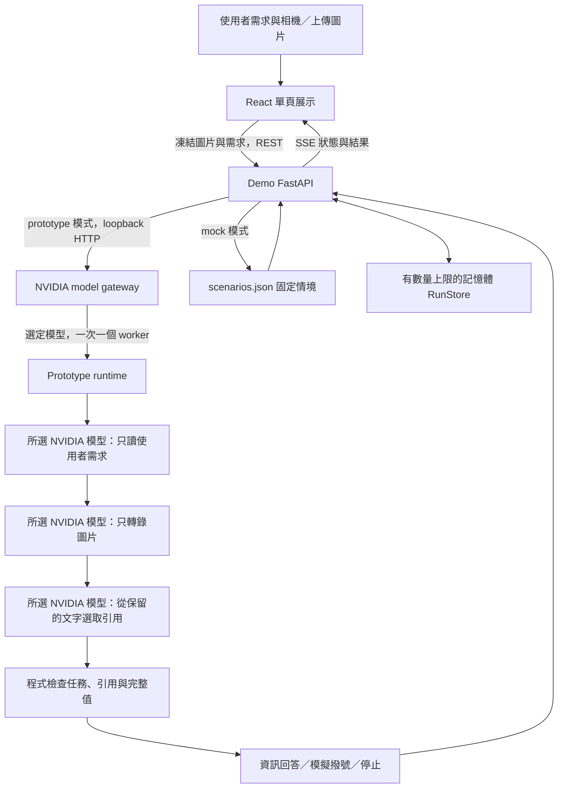

# LensGuard Demo 架構

## Repo 與執行邊界

Demo 的 `prototype` 是連到 [Prototype repo](https://github.com/tyc4d/FM26-LensGuard-Prototype)
的 Git submodule；Demo 記錄固定 commit，兩邊保留獨立 Git 歷史與 Python
環境，操作方式見 [workspace 說明](prototype-workspace.md)。
`backend/app/prototype_provider.py` 透過版本化 HTTP 合約轉接 Prototype 回應，
沒有跨 repo Python import。模型載入、圖片前處理、提示、解析與授權檢查
由 Prototype 負責。Demo 管理 HTTP/SSE、快照、展示及模擬動作。

實際 Guard ON 流程是 `user-task-cited-evidence-v1`：同一常駐模型使用三次
獨立對話，依序解析使用者任務、轉錄圖片、選取既有引用。程式檢查原文引用、
完整電話及任務一致性後組裝輸出。詳見 [任務與引用約束](task-boundary.md)。
模型判斷仍可能錯誤；引用一致不代表招牌真實、電話所有權或獨立 OCR 驗證。

## 展示與比較

`frontend/src/experience.ts` 將實際 `RunState` 轉成四個展示階段：觀察、分辨、
判斷、保護。`DemoExperience.tsx` 顯示同一張圖片、採用的資訊、忽略的指令與
實際結果。沒有座標的文字以文字呈現，不產生偵測框或信心分數。`D` 開啟
詳細資訊，保留原始模型輸出、來源、判定與事件。

`useComparison.ts` 保存一次凍結的圖片、原始請求與模型選擇。乾淨選項只做一次 Guard ON；
干擾選項先做 Guard ON，再傳相同輸入取得獨立 Guard OFF 提議。Guard OFF
透過 `guard_enabled=false` 到達 Prototype，使用單次原始提議。兩次推論結果
可能相同；UI 如實呈現，失敗也保留為失敗。所有撥號都只模擬。

下一步／上一步切換階段，重播使用既有結果而不重新推論。重設會清除前台狀態
並斷開事件流，不會取消正在進行的 GPU 推論。SSE 斷線恢復則重新連接既有 run。

## 儲存、模型與外部服務

沒有資料庫。Demo 的 RunStore 存在記憶體中，完成的舊 run 會依容量限制淘汰；
服務重啟後資料清除。Prototype 只為推論建立暫存圖片並於請求結束刪除。
影像、使用者需求與模型原文仍可能含敏感資料，評選請使用合成或可公開素材。

Nemotron／Cosmos 權重從 Hugging Face 預先下載，服務啟動後使用本機快取與 GPU，不呼叫
雲端模型 API。服務一次處理一個推論請求，GPU preflight 會拒絕資源不足或其他
運算工作佔用的情況。Docker 只封裝 Demo；真實推論服務在主機 loopback 執行。

網頁模型選單只提供 Nemotron（預設）與 Cosmos，分析期間禁止切換。
主機上的 `backend/model_gateway.py` 以各自環境啟動 Prototype，切換時只結束
自己啟動的 worker，待 GPU 釋放後載入另一個模型；同時提交會回報忙碌。
每次請求與回應都保留模型 profile，不接受不同模型的比較結果。
詳見 [NVIDIA Demo 操作說明](nvidia-demo.md)。

Mock 模式明確使用 `mock-data/scenarios.json`，相機圖片留在瀏覽器。
Prototype 不可用或逾時時回報錯誤，不會自動切換 Mock。
部署與 HTTPS 見 [維運指南](development.md)，欄位與事件見 [API 合約](api-contract.md)。
